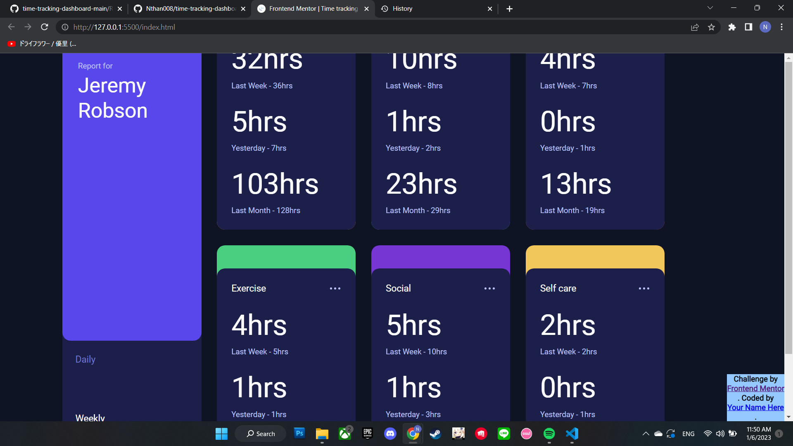

# Quiz 2 - Time tracking dashboard solution

This is a solution to the [Time tracking dashboard Quiz 2 challenge]

## Table of contents

- [Overview](#overview)
  - [The challenge](#the-challenge)
  - [Screenshot](#screenshot)
  - [Links](#links)
- [My process](#my-process)
  - [Built with](#built-with)
  - [What I learned](#what-i-learned)
  - [Continued development](#continued-development)
  - [Useful resources](#useful-resources)
- [Author](#author)
- [Acknowledgments](#acknowledgments)

**Note: Delete this note and update the table of contents based on what sections you keep.**

## Overview

### The challenge

Users should be able to:

- View the optimal layout for the site depending on their device's screen size
- See hover states for all interactive elements on the page
- Switch between viewing Daily, Weekly, and Monthly stats

### Screenshot



Add a screenshot of your solution. Crop/optimize/edit your image however you like, add it to your project, and update the file path in the image above.

**Note: Delete this note and the paragraphs above when you add your screenshot. If you prefer not to add a screenshot, feel free to remove this entire section.**

### Links

- Solution URL: (https://github.com/Nthan008/time-tracking-dashboard-main)
- Live Site URL: [Add live site URL here](https://your-live-site-url.com)

## My process

### Built with

- Semantic HTML5 markup
- CSS custom properties
- Flexbox
- CSS Grid
- [Styled Components](https://styled-components.com/) - For styles

### What I learned

Use this section to recap over some of your major learnings while working through this project. Writing these out and providing code samples of areas you want to highlight is a great way to reinforce your own knowledge.

To see how you can add code snippets, see below:

```html
<div class="menu-card">

        <div class="card-report">
            
            <div class="report">
                <p>Report for</p>
                <div class="name">Jeremy Robson</div>
            </div>
        </div>

        <div class="menu">
          <div class="menu-link" id="btn1">Daily</div>
          <div class="menu-link menu-active" id="btn2">Weekly</div>
          <div class="menu-link" id="btn3">Monthly</div>
        </div>
    </div>
```
```html
<div class="regular-card work">
        <div class="property-card">
            <div class="row">
                <div class="title">Work</div>
                <div class="points">
                    <div class="point"></div>
                    <div class="point"></div>
                    <div class="point"></div>
                </div>
            </div>

            <div class="row-2" id="week">
              <div class="hours">32hrs</div>
              <div class="description">Last Week - 36hrs</div>
          </div>
          <div class="row-2" id="day">
            <div class="hours">5hrs</div>
            <div class="description">Yesterday - 7hrs</div>
          </div>
          <div class="row-2" id="month">
            <div class="hours">103hrs</div>
            <div class="description">Last Month - 128hrs</div>
          </div>
        </div>
    </div>

```
```css
@media screen and (min-width: 570px) {
    .container {
      display: grid;
      -ms-grid-columns: 48% 48%;
          grid-template-columns: 48% 48%;
    }
    .menu-card {
      -ms-grid-column: 1;
      -ms-grid-column-span: 2;
      grid-column: 1 / span 2;
    }
    .menu-card .card-report {
      gap: 3rem;
    }
    .regular-card .property-card .row-2 {
      -webkit-box-orient: vertical;
      -webkit-box-direction: normal;
          -ms-flex-direction: column;
              flex-direction: column;
      -webkit-box-align: start;
          -ms-flex-align: start;
              align-items: flex-start;
    }
    .regular-card .property-card .row-2 .hours {
      font-size: 3rem;
    }
  }
```
```js
$(function () {
    $(".row-2").hide();
    $("#day").hide();
    $("#month").hide();
    $("#btn1").click(function () {
        $("#week").hide();
        $("#month").hide();
        $("#day").show();
    });
    $("#btn2").click(function () {
        $("#week").show();
        $("#month").hide();
        $("#day").hide();
    });
    $("#btn3").click(function () {
        $("#week").hide();
        $("#month").show();
        $("#day").hide();
    });
});

}
```

If you want more help with writing markdown, we'd recommend checking out [The Markdown Guide](https://www.markdownguide.org/) to learn more.

**Note: Delete this note and the content within this section and replace with your own learnings.**

### Continued development

Use this section to outline areas that you want to continue focusing on in future projects. These could be concepts you're still not completely comfortable with or techniques you found useful that you want to refine and perfect.

**Note: Delete this note and the content within this section and replace with your own plans for continued development.**

### Useful resources

- [Example resource 1](https://www.example.com) - This helped me for XYZ reason. I really liked this pattern and will use it going forward.
- [Example resource 2](https://www.example.com) - This is an amazing article which helped me finally understand XYZ. I'd recommend it to anyone still learning this concept.

**Note: Delete this note and replace the list above with resources that helped you during the challenge. These could come in handy for anyone viewing your solution or for yourself when you look back on this project in the future.**

## Your Detail 

- FullName - Carlo Nathanael Bessie
- StudentID - 2602236685
- BINUS Email - carlo.bessie@binus.ac.id

**Note: Delete this note and add/remove/edit lines above based on what links you'd like to share.**

## Acknowledgments

This is where you can give a hat tip to anyone who helped you out on this project. Perhaps you worked in a team or got some inspiration from someone else's solution. This is the perfect place to give them some credit.

**Note: Delete this note and edit this section's content as necessary. If you completed this challenge by yourself, feel free to delete this section entirely.**
